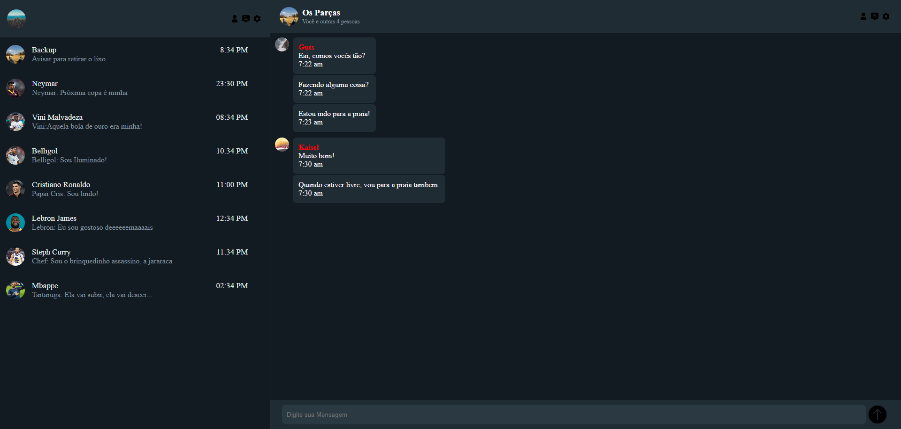
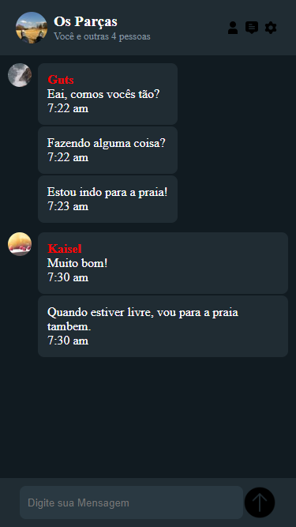

# Project Whatsapp Layout (Programação Web) 

Practical Programming Activity Web

The goal was to create a simple messaging website, inspired by the WhatsApp interface. The objective was to develop only the frontend of the project to practice the concepts being taught in class. The project was built using HTML and CSS.

Objectives:

Practice structuring web pages using semantic HTML.

Style page elements using CSS, including layout, colors, and typography.

Implement a responsive design that adapts to different screen sizes.

Use CSS positioning concepts and Flexbox.

📧 Send me an email: henrykaua21@gmail.com 

🔗 Connect with me on [LinkedIn](https://www.linkedin.com/in/henry-kaua/)

🐛 Open an [issue](https://github.com/henrymzs/whats-layout/issues) in the repository 

Any help is greatly appreciated and contributes to my growth as a developer. 🚀

Project Desktop:

Project Mobile:

